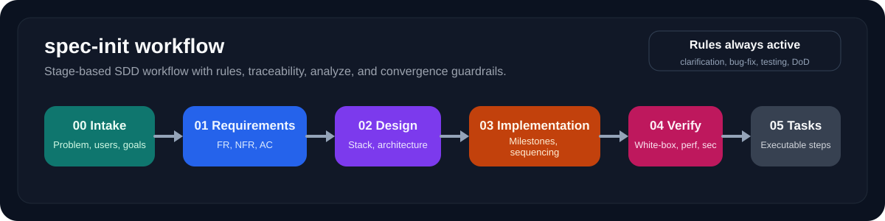
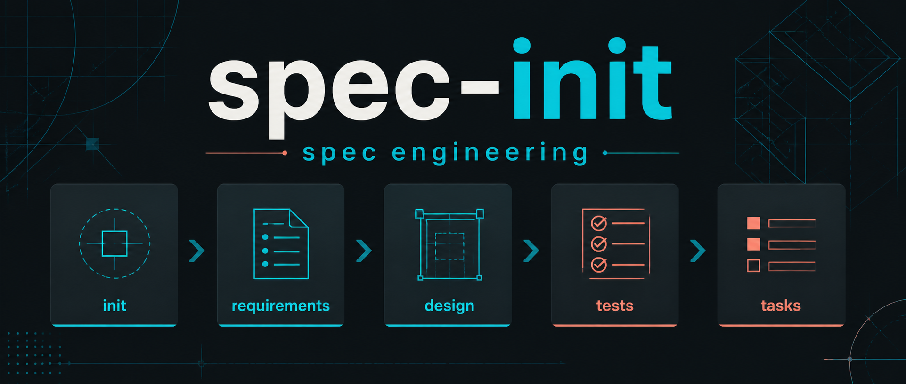

<div align="center">

# spec-init

<p>
  <strong>An SDD-oriented project kickoff skill: create documentation structure, engineering rules, and testing constraints before implementation starts.</strong>
</p>

<p>
  <a href="./README.md">简体中文</a>
  ·
  <a href="./README.en.md">English</a>
</p>

<p>
  
  
  
  
  
  
  
</p>

<table>
  <tr>
    <td><strong>Stage-based SDD</strong><br/>A directory-first flow from intake to executable tasks.</td>
    <td><strong>Built-in Rules</strong><br/>Clarification, bug-fix, and TDD guardrails ship with the scaffold.</td>
    <td><strong>Traceability</strong><br/>A project starts with an explicit `FR -> DES -> TEST -> T` chain.</td>
  </tr>
</table>





</div>

## Overview

`spec-init` is an agent skill stored in `skills/`, but it is not just a directory bootstrap script.

Its real role is to help an agent turn either a vague idea or an existing project into an executable, traceable, rule-aware spec set:

- `docs/00-intake/README.md`
- `docs/01-requirements/README.md`
- `docs/02-design/README.md`
- `docs/03-implementation/README.md`
- `docs/04-tdd/README.md`
- `docs/05-tasks/README.md`
- `docs/changes/README.md`
- `docs/releases/README.md`
- `docs/rules/README.md`
- `README.md`
- `AGENTS.md`

Core goals:

- separate requirements, design, implementation planning, TDD planning, and task breakdown
- turn document-driven development into the default workflow
- define boundaries, validation, and task relationships before coding
- maintain a full traceability chain: `FR -> DES -> TEST -> T`
- ship project-level engineering rules, not just empty document shells
- require user clarification before making material decisions
- require design docs to include stack, architecture, trade-offs, and quality goals
- require root-cause analysis for bug fixes instead of guess-based changes
- require strict TDD with relevant white-box, performance, and security coverage

## Why this exists

Many projects do not fail because of technology. They fail because these questions were never made explicit early enough:

- what exactly are we building
- why are we building it now
- what is explicitly out of scope
- how design maps to requirements
- how tests prove the work is done
- how tasks derive from requirements and design
- what engineering rules the team is supposed to follow by default

Common outcomes:

- requirements and design get mixed together
- implementation planning and task lists get mixed together
- testing is always “added later”
- the README turns into empty marketing text
- rules only live in chat or PR comments instead of the repo itself

This skill exists to solve those problems at project start.

## What it produces

During execution, the agent creates or updates these spec artifacts based on the user's goal and the real project context:

```text
docs/
docs/00-intake/README.md
docs/01-requirements/README.md
docs/02-design/README.md
docs/03-implementation/README.md
docs/04-tdd/README.md
docs/05-tasks/README.md
docs/issues/README.md
docs/rules/README.md
docs/rules/clarification-rules.md
docs/rules/coding-standards.md
docs/rules/bug-fix-rules.md
docs/rules/testing-standards.md
docs/rules/doc-sync-rules.md
docs/rules/change-management-rules.md
docs/rules/issue-management-rules.md
docs/rules/definition-of-done.md
docs/changes/README.md
docs/releases/README.md
docs/archive/README.md
docs/adr/0000-record-template.md
README.md
AGENTS.md
```

These files should not remain empty placeholders. The skill still includes template and script resources, but those are helpers, not the final result.

The resulting content should include:

- document boundary guidance
- self-check lists
- priority and version-boundary prompts
- `FR-*` / `DES-*` / `TEST-*` / `T-*` traceability expectations
- a project rules directory under `docs/rules/`
- clarification rules for material ambiguities
- root-cause bug-fix rules
- white-box / performance / security testing expectations
- frontend guidance for resolution targets, colors, typography, and component rules
- backend guidance for API, database, migration, and naming conventions
- beginner-friendly decision guides and must-ask checklists by project type
- copyable example answers, scope trimming help, and common mistake examples
- current-state synthesis for existing projects
- explicit options, trade-offs, and recommendations for missing decisions
- change-tracking entry points for new requirements, bug fixes, and releases
- support for fuller requirements, fuller design, and ongoing spec refinement
- issue tracking, document retirement, and archive support

## Structure

The generated SDD documents are now organized by stage directories instead of being flattened in the root `docs/` directory:

```text
docs/
|-- 00-intake/
|   `-- README.md
|-- 01-requirements/
|   `-- README.md
|-- 02-design/
|   `-- README.md
|-- 03-implementation/
|   `-- README.md
|-- 04-tdd/
|   `-- README.md
|-- 05-tasks/
|   `-- README.md
|-- issues/
|   `-- README.md
|-- changes/
|   `-- README.md
|-- releases/
|   `-- README.md
|-- archive/
|   `-- README.md
|-- adr/
|   `-- 0000-record-template.md
`-- rules/
    |-- README.md
    |-- clarification-rules.md
    |-- coding-standards.md
    |-- bug-fix-rules.md
    |-- testing-standards.md
    |-- doc-sync-rules.md
    |-- change-management-rules.md
    |-- issue-management-rules.md
    `-- definition-of-done.md
```

Why this structure:

- it matches the stages of SDD more clearly
- each stage can grow into a richer directory over time
- `rules/` lets the project keep engineering rules inside the generated scaffold
- `changes/` and `releases/` preserve historical context instead of losing it
- `issues/` and `archive/` give unresolved problems and retired docs a clear home
- newcomers can see what to read first and what to do next

## Supported hosts

| Host | Recommended install path | Typical invocation | Notes |
|---|---|---|---|
| Claude Code | `~/.claude/skills/spec-init` | `/spec-init` | supports richer frontmatter and dynamic injection |
| Codex | `.agents/skills/spec-init` | `$spec-init` or skill picker | compatible with the Agent Skills directory layout |
| OpenCode | `~/.config/opencode/skills/spec-init` | `/spec-init` or auto-load | also compatible with `.claude/skills` and `.agents/skills` |

## Installation

### Claude Code

```bash
cp -R skills/spec-init ~/.claude/skills/spec-init
```

### Codex

```bash
cp -R skills/spec-init /path/to/repo/.agents/skills/spec-init
```

### OpenCode

```bash
cp -R skills/spec-init ~/.config/opencode/skills/spec-init
```

## Usage examples

Different hosts use different explicit invocation syntax, but the intent is the same.

Examples:

```text
/spec-init my-app
/spec-init ./demo-service --type=api
/spec-init --here --type=web --lang=en
$spec-init my-cli --type=cli
```

You can also trigger it with natural language:

- “Turn this idea into requirements, design, and a TDD plan”
- “This is an existing project, read the code first and then help me add specs”
- “I want an API project, but start by clarifying the specs before coding”
- “Analyze this repo and tell me which docs and rules are missing”

## Project types

Currently supported:

- `web`
- `api`
- `cli`
- `library`
- `service`

If the user does not specify one, the skill makes a baseline inference from the project name and directory name, then records the reasoning in `docs/00-intake/README.md`.

## Output language

The helper template resources support:

- `--lang zh`
- `--lang en`

Current behavior:

- Chinese is the default output language
- `--lang en` generates English templates
- `web` / `api` / `cli` have differentiated templates in both languages

## Type-specific templates

`web`, `api`, and `cli` already have differentiated templates, mainly in:

- `docs/01-requirements/README.md`
- `docs/02-design/README.md`
- `docs/04-tdd/README.md`
- `docs/05-tasks/README.md`

## Built-in rules

This project no longer generates only documents. It also generates project-level engineering rules:

- `docs/rules/clarification-rules.md`
- `docs/rules/coding-standards.md`
- `docs/rules/bug-fix-rules.md`
- `docs/rules/testing-standards.md`
- `docs/rules/doc-sync-rules.md`
- `docs/rules/definition-of-done.md`

`AGENTS.md` defines execution order for agents, while `docs/rules/` keeps those rules as in-repo engineering assets.

The current rule set especially strengthens four areas:

1. material ambiguities must be confirmed with the user, with options and trade-offs explained
2. design docs must include stack, architecture, trade-offs, and quality goals
3. bug fixes must identify root cause instead of guessing
4. testing must follow strict TDD with relevant white-box, performance, and security coverage

## The real value: traceability

The real value is not the number of markdown files. The value is that the project gets pushed toward a connected chain:

- `FR-*`: what must be delivered
- `DES-*`: how the design satisfies it
- `TEST-*`: how to verify it
- `T-*`: what gets executed next

At minimum, the project should form one complete chain:

```text
FR-001 -> DES-001 -> TEST-001 -> T-001
```

Without that chain, documentation easily decays back into disconnected notes.

## Example project

See the included minimal complete example:

[`skills/spec-init/examples/demo-app/`](./skills/spec-init/examples/demo-app/)

It shows:

- how intake is written
- how requirements are written
- how design maps to requirements
- how the TDD plan maps to requirements
- how the task breakdown becomes executable work
- how `rules/` becomes part of the generated project structure

## Repository layout

```text
docs/
|-- assets/images/
|-- zh/
`-- en/
skills/
`-- spec-init/
    |-- SKILL.md
    |-- scripts/
    |-- references/
    |-- assets/
    `-- examples/
```

```text
skills/spec-init/
|-- SKILL.md
|-- scripts/
|   `-- spec-init.sh
|-- references/
|   |-- doc-boundaries.md
|   `-- example-idea-to-docs.md
|-- assets/
|   `-- templates/
|       `-- project/
`-- examples/
    `-- demo-app/
```

## Status

- agent-driven spec workflow guidance is in place
- bilingual templates, references, and example resources are in place
- differentiated spec prompts exist for `web` / `api` / `cli`
- built-in `docs/rules/` rule directory is in place
- minimal complete example project is included
- bilingual README is included
- the Bash scaffold script remains as an optional helper, not the primary product capability

## Next steps

- add stronger spec flows and examples for `service` / `library`
- strengthen existing-project spec completion scenarios
- further reduce the “empty template” feeling and improve direct agent-authored content

## License

This repository uses `PolyForm Noncommercial 1.0.0`.

That means:

- noncommercial use is allowed
- commercial use is not allowed
- distribution must include the license text or URL

See the root `LICENSE` file for the full terms.
